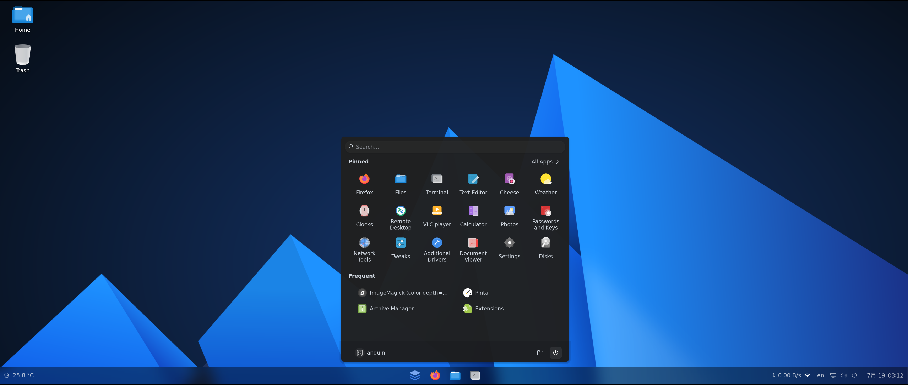

# FluxLinux

FluxLinux is a privacy and security focused Linux distro based off Ubuntu

[Download FluxLinux](https://www.fluxlinux.xyz/)



## How to build

It is suggested to use Ubuntu to build FluxLinux.

To build the OS, run the following command:

```bash
make
```

To edit the build parameters, modify the `./src/args.sh` file.

That's it. The built file will be an ISO file in the `./src/dist` directory.

Simply mount the built ISO file to an virtual machine, and you can start testing it.

## License

This project is licensed under the GNU GENERAL PUBLIC LICENSE - see the [LICENSE](LICENSE) file for details

The open-source software included in FluxLinux is distributed in the hope that it will be useful, but WITHOUT ANY WARRANTY.

[List of open-source software included in FluxLinux](OSS.md)

## Support

For community support and discussion, please join our [FluxLinux Discussions](https://codeberg.org/arcbasehq/FluxLinux/discussions).

For bug reports and feature requests, please use the [Issues](https://codeberg.org/arcbasehq/FluxLinux/issues) page.
